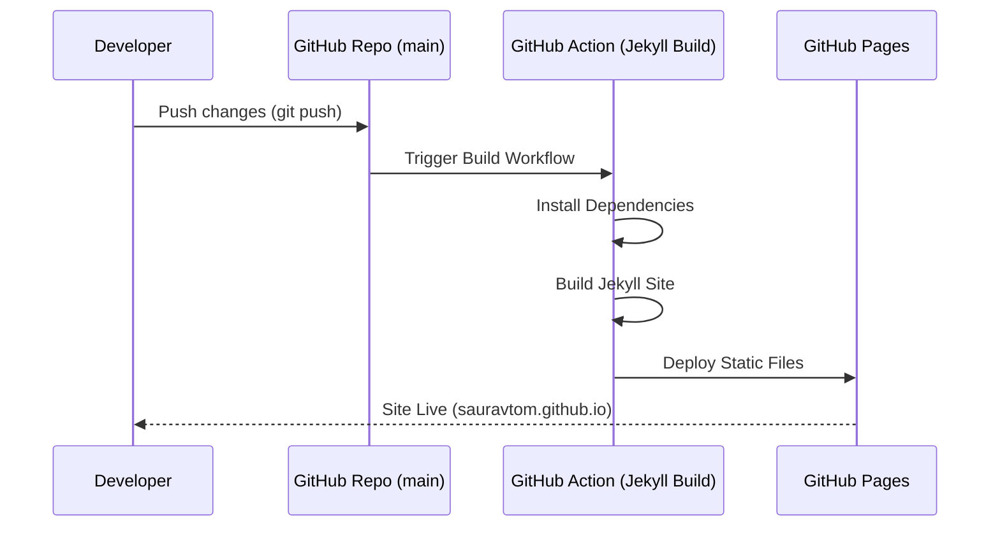

# Saurav Kumar's Personal Website & Blog

This repository hosts the source code for [sauravtom.github.io](https://sauravtom.github.io), the personal website and blog of **Saurav Kumar**.

It is a static site built with [Jekyll](https://jekyllrb.com/) and based on the [Chirpy](https://github.com/cotes2020/jekyll-theme-chirpy) theme, hosted on GitHub Pages.

## 🚀 Features

- **Professional Portfolio**: Showcases projects, talks, and press coverage.
- **Technical Blog**: Articles on AI, Blockchain, and Software Engineering with support for categories and tags.
- **Responsive Design**: Fully responsive layout that works beautifully on mobile and desktop.
- **Dark Mode**: Built-in dark/light mode toggle.
- **SEO Optimized**: Integrated SEO tags and sitemap generation.
- **Analytics**: Privacy-friendly analytics via GoatCounter and Google Analytics.
- **PWA Support**: Installable as a Progressive Web App.

## 📂 Project Structure

Here's an overview of the key directories and files:

```
.
├── _config.yml          # Main configuration (site settings, plugins, theme)
├── _posts/              # Blog posts (markdown files)
├── _tabs/               # Tab pages (About, Categories, Tags, etc.)
├── _pages/              # Standalone pages (Press, Profile, Projects)
├── _data/               # Data files (locales, etc.)
├── assets/              # Static assets (images, CSS, JS)
├── tools/               # Utility scripts
├── Gemfile              # Ruby dependencies
└── README.md            # This file
```

## 🛠️ Local Development

### Prerequisites

- **Ruby**: v2.7 or higher
- **Bundler**: `gem install bundler`
- **Jekyll**: `gem install jekyll`

### Installation

1.  **Clone the repository**:
    ```bash
    git clone https://github.com/sauravtom/sauravtom.github.io.git
    cd sauravtom.github.io
    ```

2.  **Install dependencies**:
    ```bash
    bundle install
    ```

### Running Locally

To start the local development server with live reload:

```bash
bundle exec jekyll serve
```

Access the site at `http://127.0.0.1:4000/`.

## 🔄 Deployment Workflow

The site is automatically built and deployed to GitHub Pages via GitHub Actions whenever changes are pushed to the `main` branch.



## 📝 Content Management

### Adding a New Post

Create a new markdown file in `_posts/` with the format `YYYY-MM-DD-title.md`.

**Front Matter Example:**

```yaml
---
title: "My New Post"
date: 2023-10-27 12:00:00 +0530
categories: [Tech, AI]
tags: [llm, tutorial]
---
```

### Adding a New Page

Create a markdown file in `_pages/` or `_tabs/` and ensure it has the correct `layout` and `permalink`.

## 📄 License

This project is licensed under the MIT License.
